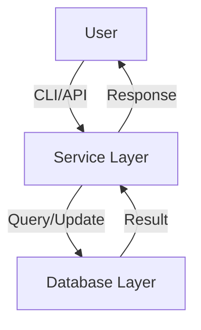

# Cyclist Database Documentation

This document consolidates all documentation for the Cyclist Database project.

## Table of Contents

1. [Setup Guide](#setup-guide)
2. [Usage Guide](#usage-guide)
3. [Contributing Guide](#contributing-guide)
4. [Architecture Overview](#architecture-overview)
5. [Mistral Vibe Instructions](#mistral-vibe-instructions)

---

## Setup Guide

### Prerequisites

- **Python**: 3.14.4 or later (recommended).
- **Database**: SQLite (default) or your preferred database.
- **Git**: For version control.

### Installation Steps

#### 1. Clone the Repository

```bash
git clone https://github.com/datadutch/cyclist-database.git
cd cyclist-database
```

#### 2. Create a Virtual Environment

```bash
python3 -m venv venv
```

- **Activate the environment**:
  - **macOS/Linux**: `source venv/bin/activate`
  - **Windows**: `venv\Scripts\activate`

#### 3. Install Dependencies

```bash
pip install -r scripts/requirements.txt
```

If `requirements.txt` does not exist, create it and list all dependencies:

```bash
echo "sqlite3" > scripts/requirements.txt
pip install -r scripts/requirements.txt
```

#### 4. Configure the Database

By default, the project uses SQLite. To use a different database:

1. Install the appropriate driver (e.g., `psycopg2` for PostgreSQL).
2. Update the database configuration in `config.py` (if applicable).

#### 5. Run the Application

```bash
python main.py
```

### Verification

- Check the Python version:
  ```bash
  python --version
  ```
- Verify dependencies:
  ```bash
  pip list
  ```

### Troubleshooting

- **Python not found**: Ensure Python 3.14+ is installed and in your `PATH`.
- **Dependency errors**: Run `pip install --upgrade pip` and retry.
- **Database issues**: Check permissions and ensure the database file is writable.

---

## Usage Guide

### Running the Application

#### Basic Usage

1. **Start the application**:
   ```bash
   python main.py
   ```

2. **Interactive Mode**:
   - Follow the on-screen prompts to add, view, or update cyclist records.

#### Command-Line Arguments

The application supports the following arguments:

| Argument | Description | Example |
|----------|-------------|---------|
| `--help` | Show help message | `python main.py --help` |
| `--version` | Show version | `python main.py --version` |
| `--db-path` | Specify database path | `python main.py --db-path /path/to/db.sqlite` |

#### Examples

1. **Run with a custom database path**:
   ```bash
   python main.py --db-path /tmp/cyclist.db
   ```

2. **View help**:
   ```bash
   python main.py --help
   ```

### Database Operations

#### Adding a Cyclist

1. Select the "Add Cyclist" option from the menu.
2. Enter the cyclist details (name, age, team, etc.).
3. Confirm the entry.

#### Querying Cyclists

1. Select the "Query Cyclists" option.
2. Choose a filter (e.g., by team, age range).
3. View the results.

#### Updating Records

1. Select the "Update Cyclist" option.
2. Search for the cyclist by ID or name.
3. Edit the fields and save.

### Advanced Usage

#### Batch Operations

To perform batch operations (e.g., importing from CSV):

```bash
python scripts/import_csv.py --input data/cyclists.csv
```

#### Exporting Data

Export data to CSV:

```bash
python scripts/export_csv.py --output data/export.csv
```

### Notes

- Ensure the database file is writable.
- Backup the database before performing bulk operations.

---

## Contributing Guide

Thank you for your interest in contributing to the Cyclist Database project! This guide outlines how to contribute effectively.

### How to Contribute

#### Reporting Issues

- Use the [GitHub Issues](https://github.com/datadutch/cyclist-database/issues) page to report bugs or suggest features.
- Include:
  - A clear title and description.
  - Steps to reproduce (for bugs).
  - Expected vs. actual behavior.

#### Submitting Pull Requests

1. **Fork the repository** and clone your fork.
2. **Create a branch** for your feature/fix:
   ```bash
   git checkout -b feature/your-feature-name
   ```
   **Note**: Never commit or push directly to `main`. Always use a feature branch.
3. **Make changes** and commit them:
   ```bash
   git commit -m "Add feature: your feature description"
   ```
4. **Push to your fork**:
   ```bash
   git push origin feature/your-feature-name
   ```
5. **Open a Pull Request** (PR) to the `main` branch of the original repository.

### Coding Standards

#### Python

- Follow [PEP 8](https://www.python.org/dev/peps/pep-0008/) guidelines.
- Use descriptive variable and function names.
- Include docstrings for functions and classes.

#### Commits

- Use clear, concise commit messages.
- Prefix commits with:
  - `feat`: New feature.
  - `fix`: Bug fix.
  - `docs`: Documentation changes.
  - `refactor`: Code refactoring.
  - `chore`: Maintenance tasks.

#### Testing

- Ensure your changes do not break existing functionality.
- Add tests for new features if applicable.

### Development Setup

1. Clone the repository:
   ```bash
   git clone https://github.com/datadutch/cyclist-database.git
   ```
2. Create a virtual environment:
   ```bash
   python3 -m venv venv
   source venv/bin/activate
   ```
3. Install dependencies:
   ```bash
   pip install -r scripts/requirements.txt
   ```

### Review Process

- PRs will be reviewed by maintainers.
- Address feedback promptly.
- Once approved, your changes will be merged.

### License

By contributing, you agree that your contributions will be licensed under the project's [MIT License](LICENSE).

---

## Architecture Overview

This document describes the high-level architecture of the Cyclist Database project.

### System Components

#### 1. Core Modules

- **`database/`**: Database models and operations.
  - `models.py`: Defines data models (e.g., `Cyclist`, `Team`).
  - `queries.py`: Database query functions.

- **`services/`**: Business logic and services.
  - `cyclist_service.py`: Handles cyclist-related operations.
  - `team_service.py`: Manages team data.

- **`api/`**: API endpoints (if applicable).
  - `routes.py`: Defines API routes.
  - `handlers.py`: Request handlers.

#### 2. Database

- **Default**: SQLite (file-based).
- **Supported**: PostgreSQL, MySQL (via configuration).
- **Schema**:
  - `cyclists`: Stores cyclist details (ID, name, age, team, etc.).
  - `teams`: Stores team information (ID, name, country).

#### 3. CLI Interface

- **`main.py`**: Entry point for the command-line interface.
- **Commands**:
  - `add`: Add a new cyclist.
  - `query`: Search for cyclists.
  - `update`: Modify cyclist records.

### Data Flow

1. **User Input**: CLI or API request.
2. **Service Layer**: Processes input and validates data.
3. **Database Layer**: Executes queries or updates.
4. **Response**: Returns results to the user.



### Configuration

- **`config.py`**: Centralized configuration (database path, logging, etc.).
- **Environment Variables**: Override settings via `.env` file.

### Example Workflow

#### Adding a Cyclist

1. User runs `python main.py add`.
2. CLI prompts for cyclist details.
3. `cyclist_service.py` validates and formats the data.
4. `queries.py` inserts the record into the database.
5. Success message is displayed.

### Dependencies

- **Python**: 3.14.4+
- **Database**: SQLite (default), with optional support for PostgreSQL/MySQL.
- **Libraries**: `sqlite3` (built-in), `argparse` (for CLI).

### Future Enhancements

- **Web Interface**: Flask/Django frontend.
- **Advanced Queries**: Filtering, sorting, and pagination.
- **Export/Import**: CSV/JSON support.

---

## Mistral Vibe Instructions

This file contains guidelines and preferences for Mistral Vibe when working on this repository.

### General Rules

- **Be concise**: Prefer short, actionable responses.
- **Prioritize code**: Show code or file references first, explanations second.
- **Verify changes**: Always confirm edits with `read_file` or tests.

### Workflow Preferences

1. **Investigate first**: Use `grep` and `read_file` to understand the codebase before making changes.
2. **Plan changes**: List files and specific edits before executing.
3. **Minimal changes**: Only modify what is explicitly requested.

### Constraints

- **No proactive commits**: Let the user review and commit changes.
- **Never commit or push to `main`**: Always use feature branches.
- **Respect existing style**: Match indentation, naming, and error handling.
- **No unsolicited refactoring**: Focus on the task at hand.

### Tools to Use

- `grep`: Search for patterns or function definitions.
- `read_file`: Inspect files before editing.
- `search_replace`: Make targeted edits.
- `bash`: Run system commands (e.g., `git`, `python`).

### Example Tasks

#### Adding a Feature

1. Search for relevant files: `grep(pattern="cyclist", path=".")`
2. Read key files: `read_file(path="src/cyclist.py")`
3. Plan changes (list files and edits).
4. Execute with `search_replace`.
5. Verify with `read_file` or tests.

#### Debugging

1. Reproduce the issue.
2. Search for error messages: `grep(pattern="Error: .*")`
3. Inspect logs or relevant code sections.
4. Propose a fix and verify.

### Notes

- Ask for clarification if the task is ambiguous.
- Prefer `search_replace` over `write_file` for existing files.

### User Preferences

- **Denied Tools**:
  - `bash` for `git reset` commands.

### Workflow Rules

- **Feature Branches**: Always pull the latest `main` branch before creating a new feature branch:
  ```bash
  git checkout main
  git pull origin main
  git checkout -b feature/your-feature-name
  ```

- **Scraping Guidelines**: Before scraping any website, always check the `robots.txt` file to ensure compliance with the website's scraping policies. For example:
  ```bash
  curl https://example.com/robots.txt
  ```
  Ensure that the paths you intend to scrape are not disallowed.
