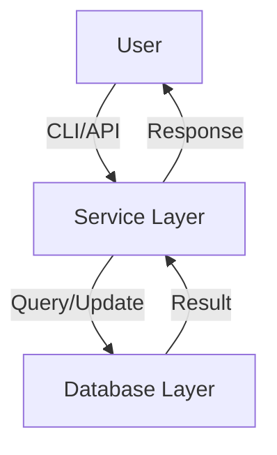

# Architecture Overview

This document describes the high-level architecture of the Cyclist Database project.

## System Components

### 1. Core Modules

- **`database/`**: Database models and operations.
  - `models.py`: Defines data models (e.g., `Cyclist`, `Team`).
  - `queries.py`: Database query functions.

- **`services/`**: Business logic and services.
  - `cyclist_service.py`: Handles cyclist-related operations.
  - `team_service.py`: Manages team data.

- **`api/`**: API endpoints (if applicable).
  - `routes.py`: Defines API routes.
  - `handlers.py`: Request handlers.

### 2. Database

- **Default**: SQLite (file-based).
- **Supported**: PostgreSQL, MySQL (via configuration).
- **Schema**:
  - `cyclists`: Stores cyclist details (ID, name, age, team, etc.).
  - `teams`: Stores team information (ID, name, country).

### 3. CLI Interface

- **`main.py`**: Entry point for the command-line interface.
- **Commands**:
  - `add`: Add a new cyclist.
  - `query`: Search for cyclists.
  - `update`: Modify cyclist records.

## Data Flow

1. **User Input**: CLI or API request.
2. **Service Layer**: Processes input and validates data.
3. **Database Layer**: Executes queries or updates.
4. **Response**: Returns results to the user.

## Configuration

- **`config.py`**: Centralized configuration (database path, logging, etc.).
- **Environment Variables**: Override settings via `.env` file.

## Example Workflow

### Adding a Cyclist

1. User runs `python main.py add`.
2. CLI prompts for cyclist details.
3. `cyclist_service.py` validates and formats the data.
4. `queries.py` inserts the record into the database.
5. Success message is displayed.

## Dependencies

- **Python**: 3.14.4+
- **Database**: SQLite (default), with optional support for PostgreSQL/MySQL.
- **Libraries**: `sqlite3` (built-in), `argparse` (for CLI).

## Future Enhancements

- **Web Interface**: Flask/Django frontend.
- **Advanced Queries**: Filtering, sorting, and pagination.
- **Export/Import**: CSV/JSON support.
